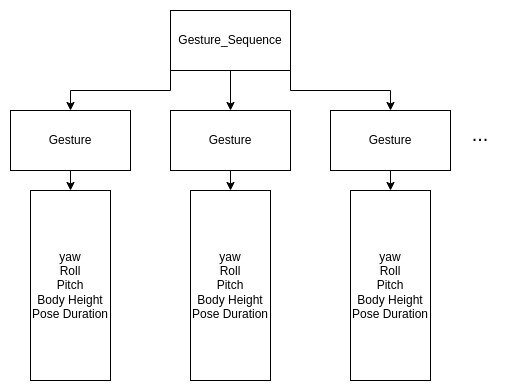

# Spot Driver

This packages handles low level control of the Spot robot and provides a bridge between the original Boston Dynamics python API and ROS2. 

## Hierarchy

### Spot Wrapper
The ```SpotWrapper``` python class handles the interface with the Boston Dyamics API, including claiming a Lease on the robot, managing internal robot state management, access to cameras, managing the E-stop, etc. This interface also manages most other commands you would normally send to the robot via the tablet controller such as docking, pose commands, and instantaneous velocity commands.

### SpotROS
The Boston Dynamics API uses Google protobuf to publish messages internally, which is similar but incompatible with the communication means of both ROS1 and ROS2. The ```SpotROS``` python ROS2 node therefore acts as the bridge between the two architectures. Using the ```SpotWrapper``` interface, ```SpotROS``` performs tasks such as publishing TF data, odometry, camera topics, battery state, etc. to the ROS2 framework. It also provides ROS access to built-in commands like those present on the control tablet through the contained ```SpotWrapper``` instance. These are all available as ROS services. Finally, this wrapper subscribes to the traditional ```~/cmd_vel``` topic for robot mobililty commands, as well as a ```~/body_pose``` topic which commands the robot body's elevation and orientation (note that x and y components of the pose are ignored).

As a convenience, the ```ros_helpers.py``` library provides one-line conversions between native BD data types and ROS message/service types. This includes transforms, images, joint states, as well as custom status messages like dock state and power state.

### SpotDriver
```spot_driver.py``` is a ROS2 executable script which simply creates an instance of ```SpotROS``` and attempts to claim a Lease on the designated robot, and then spins until shutdown. Note that the ```exec``` token for this executable is simply called ```driver```. For most users, this will be your point of entry in controlling Spot through ROS. However, check the ```SpotBringup``` package for a more streamlined experience which also brings up the robot description for use in RViz.

### Launch

This package contains a single launch file ```driver.launch.py``` which runs the ```driver``` executable with all provided arguments, and additionally brings up the Velodyne LiDAR in Spot's payload. See the documentation for the Velodyne ROS interface [here](https://index.ros.org/p/velodyne/github-ros-drivers-velodyne/). 

## Creating and executing a Spot Gesture
Spot currently has three gestures it can execute. They can be called in the form of a ROS2 service call. The first two are predefined gestures, while the third allows anyone to create their own gesture called a gesture sequence. The ROS2 call looks like `/spot_driver/gesture_sequence`

### Gesture Modes
1. sassy_confused
2. no_nod
3. gesture_sequence
4. water_shakeoff
5. serious_stance

### Executing Gestures
To execute the predefined gestures, run the following commands, and the gesture mode field changes based on the gesture you want to run
```bash
ros2 service call /spot_driver/gesture_sequence spot_msgs/srv/GestureSequence "{gesture_mode: '<desired_gesture>'}"

```

For example...
```bash
ros2 service call /spot_driver/gesture_sequence spot_msgs/srv/GestureSequence "{gesture_mode: 'sassy_confused'}"

```

### Creating your own Gesture Sequence
To create your own sequence you need to understand the service type.
The service type takes in a list of lists, where each nested list contains 5 float32 values. So the list is called a gesture_sequence, and within this we have N lists called gestures.  Each gesture contains 5 parameters describing the gesture Spot will perform. Don't forget to change the gesture mode to `gesture_sequence`



Keep in mind that each parameter for a gesture has limits
- yaw: (-0.6, 0.6) {in units of radians}
- roll: (-0.6, 0.6) {in units of radians}
- pitch: (-0.6, 0.6) {in units of radians}
- body height: (-0.2, 0.2) {in units of meters}
- pose duration: [0, infinity] (in units of seconds) 

Finally to execute the gesture sequence either call it through the terminal such as...
```bash
ros2 service call /spot_driver/gesture_sequence spot_msgs/srv/GestureSequence "{
  gesture_mode: 'gesture_sequence',
  gesture_sequence: [
    {roll: 0.0, pitch: 0.1, yaw: 0.0, body_height: 0.05, pose_duration: 2.0},
    {roll: 0.0, pitch: -0.1, yaw: 0.0, body_height: 0.05, pose_duration: 2.0}
  ]
}"
```
or create a ROS2 client